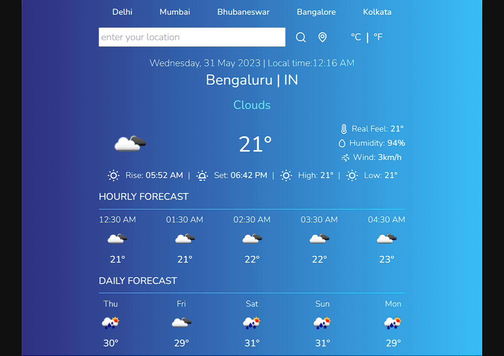

# WeatherWind 🌨️

WeatherWind is an open source react web app that allow the user to know the current weather data of your region. It can Show the Weather Condition on Daily Basis for 5 days and also Hourly for 5 hours and also shows the current local time

## Built With

- [create-react-app](https://www.npmjs.com/package/create-react-app)
- [Tailwind Css](https://tailwindcss.com/docs/guides/create-react-app)
- [Unicons](https://github.com/IconScout/react-unicons)
- [Luxon](https://github.com/moment/luxon)
- [react-toastify](https://www.npmjs.com/package/react-toastify)
- [Open Weather API](https://openweathermap.org/api)

## Features

- Global daily and hourly weather forecast
- Weather Conditions like, Tempreture, Humidity, Wind, Sunrise and Sunset are available
- Current Location feature is also active, So you can search weather report according to your location
- Multiple Coloured User Interfaces for Hot and Cold Conditions
- Toaster for the notifications
- Choose between Celcius and Farenheit

## Installation

```
npm install
```

## Preview



## Contributing

Pull requests are welcome. For major changes, please open an issue first
to discuss what you would like to change.

Please make sure to update tests as appropriate.
